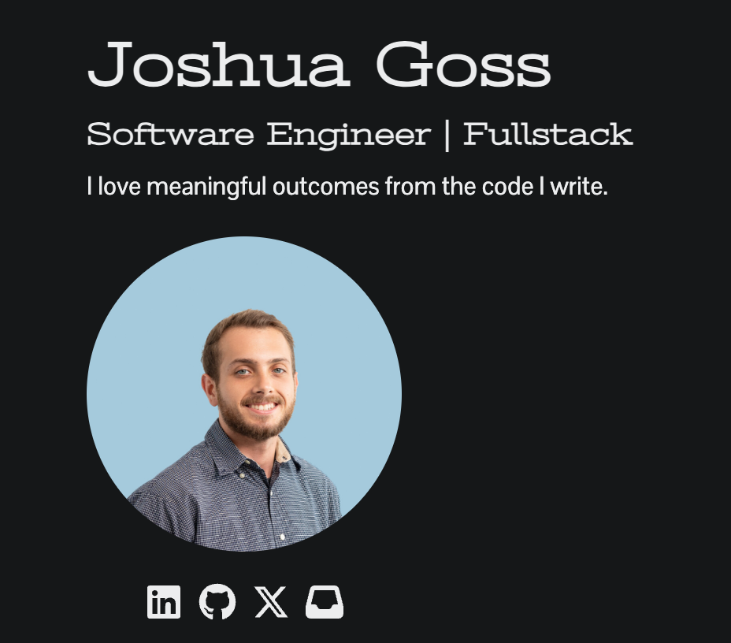

# Welcome to my website 👋

[Joshuagoss.dev](https://joshuagoss.dev) is my website which serves as my portfolio and blog.
This project was built using ReactNative, Typescript, Expo, and Markdown.


## Get started

1. Install dependencies

   ```bash
   npm install
   ```

2. Start the app

   ```bash
    npx expo start
   ```
